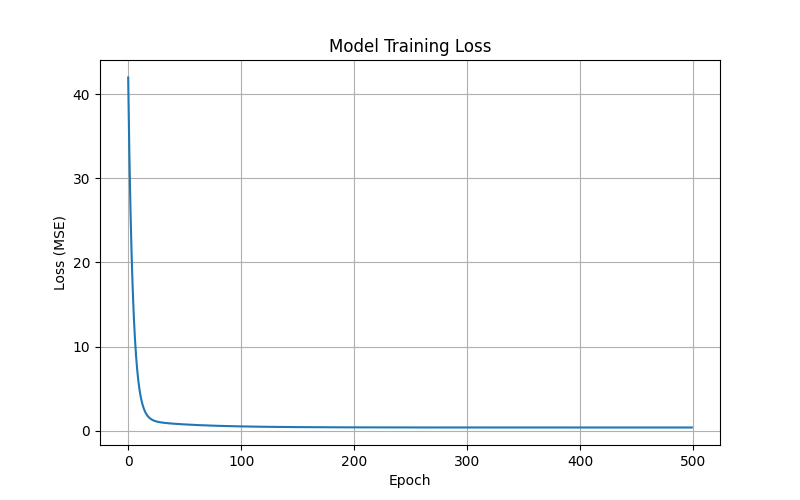
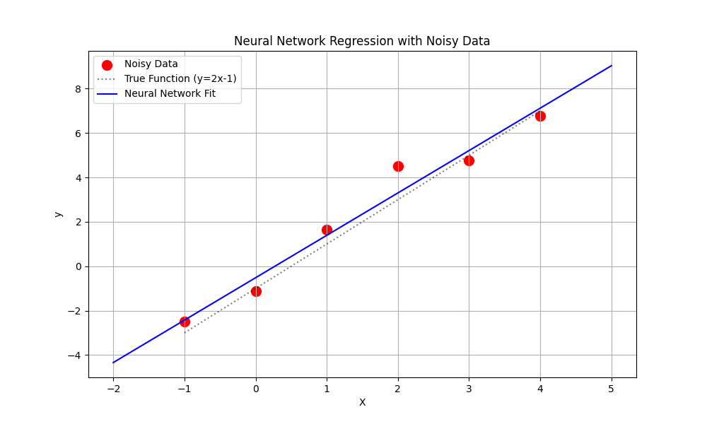

# 01_hello_nn.py 실행 결과

## 학습 데이터

```
X: [-1.  0.  1.  2.  3.  4.]
y (clean): [-3. -1.  1.  3.  5.  7.]
y (noisy): [-2.50328585 -1.1382643   1.64768854  4.52302986  4.76584663  6.76586304]
```

## 학습 결과

| 항목 | 학습값 | 기대값 |
|------|--------|--------|
| Weight (w) | 1.9113 | 2.0 |
| Bias (b) | -0.5217 | -1.0 |

- 학습된 공식: `y = 1.9113x + -0.5217`
- x=10.0 예측값: **18.5912** (기대값: 19.0)

## 출력 파일

### 학습 손실 그래프


### 모델 피팅 그래프


## 사용 모델

- TensorFlow 2.21.0 / Keras Sequential 신경망
- 방법: 경사하강법 (Gradient Descent)
