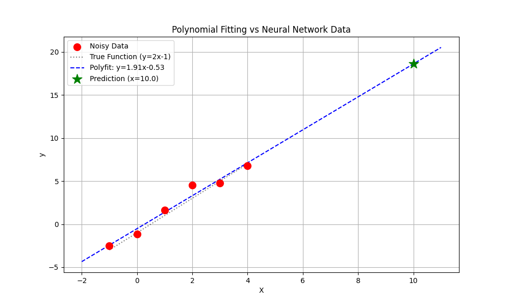

# 02_polynomial_fitting.py 실행 결과

## 학습 데이터

```
X: [-1.  0.  1.  2.  3.  4.]
y (clean): [-3. -1.  1.  3.  5.  7.]
y (noisy): [-2.50328585 -1.1382643   1.64768854  4.52302986  4.76586304  6.76586304]
```

## 목표 함수

`y = 2x - 1`

## 방법별 결과

| 방법 | 결과 공식 | x=10 예측 |
|------|----------|-----------|
| NumPy Polyfit | y = 1.9124x - 0.5251 | 18.5987 |
| SciPy Curve Fit | y = 1.9124x - 0.5251 | 18.5987 |

## 방법 비교

| 방법 | 접근 방식 |
|------|----------|
| Neural Network (01번) | 경사하강법 (반복 학습) |
| NumPy Polyfit | 해석적 해 (선형대수) |
| SciPy Curve Fit | 수치 최적화 (Levenberg-Marquardt) |

## 출력 파일

### 피팅 결과 그래프

